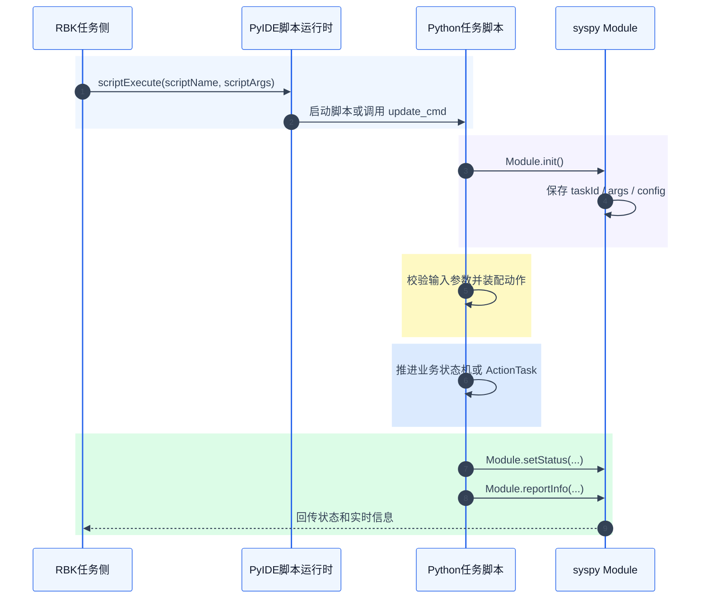
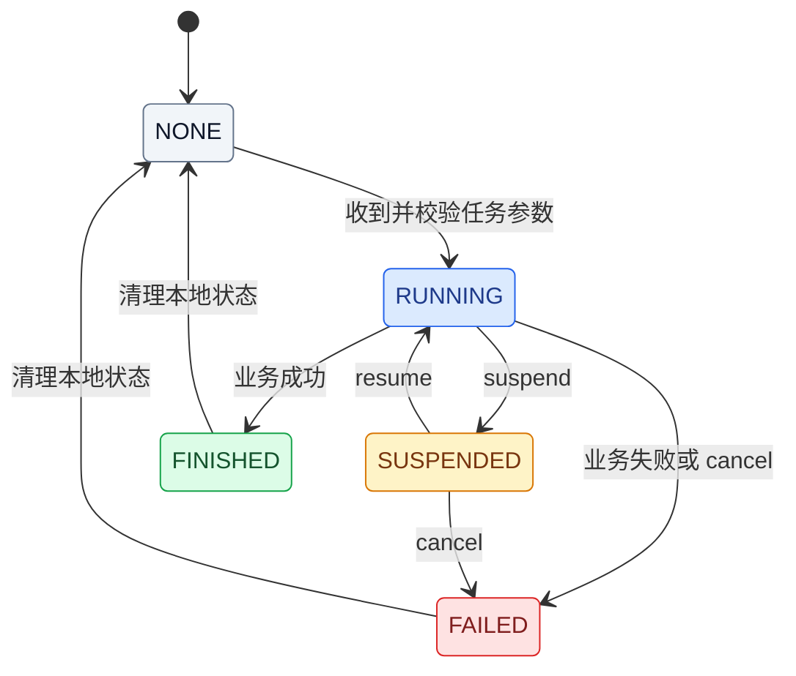
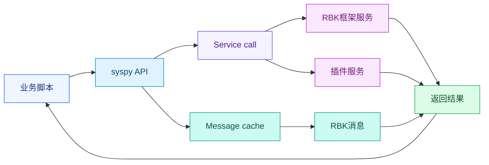
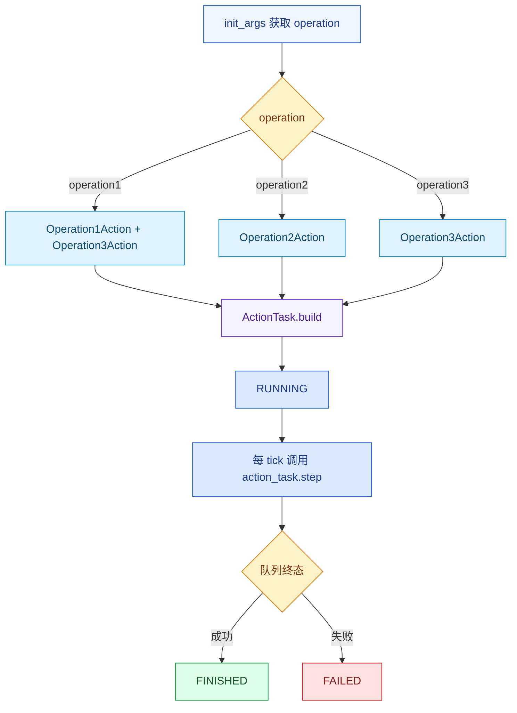
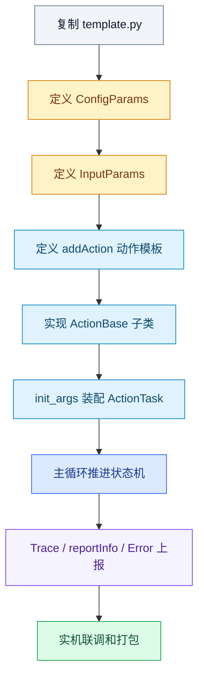

# RBK3.5 脚本开发完整示例教程

本文面向 RBK3.5 任务脚本开发者，目标是让开发者能基于现有模板写出可部署、可调试、可观测、能正确响应任务生命周期的脚本。教程主线基于当前空模板：

```text
tasks/v3/standard/example/template.py
```

新脚本建议复制这份模板，再替换模块名、参数、动作类和业务状态机。本文只讲脚本开发者需要掌握的概念和接口，不展开 RBK 插件内部实现。

相关入口：

- `README.md`：脚本仓库上手说明
- `docs/guide/spec/logging.md`：日志和 `reportInfo` 规范
- `docs/guide/spec/rbk2py.md`：RBK 插件 RPC 接口接入规范
- `tasks/v3/standard/example/template.py`：标准任务脚本空模板
- `tasks/v3/standard/module/`：复杂业务脚本参考

## 一、运行模型

### 脚本是什么

RBK 任务脚本是运行在 PyIDE 管理下的 Python 进程。调度侧下发脚本任务后，PyIDE 会启动脚本，或向已经驻留的任务脚本下发新任务。脚本本身负责解析任务参数、执行业务、调用 RBK 能力接口、上报状态、上报实时信息和异常。



脚本不是普通的一次性函数。标准任务脚本通常长期驻留：空闲时等待新任务，执行中持续推进状态机，结束后清理本地状态并回到空闲。

### 脚本运行目录

脚本运行目录是 RBK 加载脚本、生成参数文件和计算脚本相对路径的根目录。当前根目录固定为：

```text
/opt/.data/rbk/resources/scripts/
```

`Module.init()` 会基于这个根目录计算脚本相对路径；`ScriptParam(__file__)` 也要求脚本文件位于这个根目录下。开发和联调时建议把模板复制为：

```text
/opt/.data/rbk/resources/scripts/tasks/v3/standard/example/my_task.py
```

脚本第一次运行或导入参数定义后，会在 `params/` 下生成三类参数文件：

```text
/opt/.data/rbk/resources/scripts/params/tasks/v3/standard/example/my_task_config.json
/opt/.data/rbk/resources/scripts/params/tasks/v3/standard/example/my_task_input.json
/opt/.data/rbk/resources/scripts/params/tasks/v3/standard/example/my_task_action.json
```

### Module

`Module` 是任务脚本运行时管理类。它负责脚本初始化、接收任务参数、记录任务 ID、上报脚本状态、上报实时信息，并注册外部可以调用的脚本服务。

模板主入口中必须先初始化运行时：

```python
def main():
    ScriptParam.setConfigChangeCallBack(script_config_callback)
    RobotParam.setDeviceChangeCallBack(robot_device_callback)

    Module.init()
    m = ModuleXXX()
```

`Module.init()` 会完成几件事：

- 计算脚本标识和脚本类型。
- 解析启动参数中的 `taskId`、`args`、`config`。
- 把 `config` 临时合并到脚本配置参数。
- 注册 `update_cmd`、`suspend`、`resume`、`cancel`、`safe_move_check`、`modbus`、容器绑定等脚本服务。

脚本中最常用的 `Module` 接口：

| 接口 | 作用 |
|------|------|
| `Module.getTaskArgs()` | 获取当前任务输入参数，也就是 `scriptArgs.args` |
| `Module.getTaskConfig()` | 获取当前任务临时配置，也就是 `scriptArgs.config` |
| `Module.getTaskId()` | 获取当前任务 ID |
| `Module.getStatus()` | 获取当前脚本状态 |
| `Module.setStatus(status)` | 向 RBK 回传当前脚本状态 |
| `Module.reportInfo(info)` | 上报调度和 Roboshop 可见的实时信息 |

主循环里应持续调用 `Module.setStatus(m.status)`。当状态上报为 `FINISHED` 或 `FAILED` 后，`Module` 会清空当前任务参数、任务 ID 和任务临时配置，因此业务侧要在终态后重置本地状态，回到 `NONE` 等待下一单。

### ModuleBase

`ModuleBase` 是任务脚本基类。继承它的业务类必须能响应任务暂停、恢复、取消、安全检查等外部事件。

模板中的业务类：

```python
class ModuleXXX(ModuleBase):
    def suspend(self):
        if Module.getStatus() == ScriptStatus.RUNNING:
            self.action_task.suspend()
            self.set_status(ScriptStatus.SUSPENDED)

    def resume(self):
        if Module.getStatus() == ScriptStatus.SUSPENDED:
            self.action_task.resume()
            self.set_status(ScriptStatus.RUNNING)

    def cancel(self):
        self.action_task.cancel()
        self.set_status(ScriptStatus.FAILED)
```

这些方法不是普通辅助函数，而是脚本生命周期回调：

| 回调 | 什么时候发生 | 脚本应该做什么 |
|------|--------------|----------------|
| `suspend()` | 任务暂停 | 暂停动作队列，停止或保持硬件副作用，置 `SUSPENDED` |
| `resume()` | 暂停后恢复 | 恢复动作队列，置 `RUNNING` |
| `cancel()` | 任务取消 | 取消动作队列，释放硬件副作用，置 `FAILED` |
| `safeMoveCheck()` | 底盘移动前安全检查 | 检查机构、货物、传感器，调用 `setSafeMoveStatus()` |
| `modbus()` | Modbus 任务事件 | 从 Modbus 数据解析任务参数并执行对应业务 |

如果脚本控制过电机、识别、路径、机械臂、IO 等外部副作用，必须在 `cancel()` 和必要的 `suspend()` 中释放或停止。不要只改脚本状态而不处理硬件。

### ScriptStatus

`ScriptStatus` 是任务脚本和 RBK 之间约定的状态值。脚本必须通过 `Module.setStatus()` 持续回传状态。

| 状态 | 值 | 含义 |
|------|----|------|
| `NONE` | 0 | 空闲，可以接收新任务 |
| `RUNNING` | 1 | 任务执行中 |
| `NEARTOGOAL` | 2 | 接近目标，少用 |
| `FINISHED` | 3 | 成功终态 |
| `FAILED` | 4 | 失败终态 |
| `SUSPENDED` | 5 | 暂停中 |

推荐状态流转：



主循环里只有 `NONE` 状态应该接收新任务。任务执行完成后，要重置动作队列、本地参数和实时信息，再回到 `NONE`。

## 二、参数与任务下发

### 脚本配置参数

脚本配置参数是“这台机器人上这个脚本如何工作”的长期配置。它们由 `ScriptParam.builderConfig()` 定义，并生成 `*_config.json`。

参考 `tasks/v3/standard/module/` 中的复杂脚本，配置参数通常分成这些类别：

| 类别 | 典型字段 | 说明 |
|------|----------|------|
| 通用控制 | `debugMode`、`scriptDebug`、`timeout`、`loadTime`、`unloadTime` | 调试开关、任务超时、动作超时 |
| 机构运动 | `liftMotorSpeed`、`rotateMotorSpeed`、`stretchMotorSpeed`、`fork_max_speed` | 电机速度、默认运动速度 |
| 机构限位 | `maxForkHeight`、`minForkHeight`、`safeLiftHeight`、`maxRotateAngle`、`maxStretchLength`、`safeStretchLength` | 高度、角度、伸缩长度、安全位置 |
| 识别配置 | `boxCodeFile`、`shelfCodeFile`、`barcodeFile`、`recOffzBox`、`recOffzShelf`、`recCenterX`、`recCenterY`、`recRadius` | 识别文件、识别高度补偿、识别区域 |
| 识别阈值 | `okX`、`okYaw`、`maxYawBias`、`errorRecY`、`errorRecAngle`、`errorRecTiltAngle` | 识别结果是否可用、是否需要调整、是否失败 |
| 货位/容器 | `low0`、`high0`、`low1`、`high1`、`container` 相关高度 | 背篓层高、货位高度、容器映射 |
| DI/DO 与安全检测 | `goodsCheckDi`、`overlimitDetectDi`、`fork_tip_di_sensors`、`upDo`、`downDo`、`lightDelayTime` | 货物检测、限位检测、输出控制、补光延时 |
| 导航和避障配合 | `fork_root_2D_lasers`、`fork_tip_2D_lasers`、`loadObsStopDist`、`forkDiDist`、`aheadDist`、`minAheadDist` | 激光/DI 屏蔽、避障距离、路径调整参数 |

设备模型中已经存在的绑定，例如 `Model-000.moduleType`、电机 key、部分 DI/DO 绑定，标准模块通常通过 `RobotParam.getDevice()` 读取，而不是重复写进脚本配置。脚本配置更适合保存该脚本独有的阈值、补偿、开关和动作默认值。

模板中的配置参数结构：

```python
class ConfigParams:
    param11 = None
    param12 = None
    param21 = None
    debug_mode = False

    @classmethod
    def init(cls):
        builder = script_param.builderConfig()
        with builder.GROUPS():
            with builder.GROUP(key="group1", name="Group1 name", desc="Group1 desc"):
                builder.TYPE(ParamType.ARRAY)
                with builder.CHILDREN():
                    with builder.CHILD(key="param11", name="Param11 name", desc="param11 desc"):
                        builder.TYPE(ParamType.STRING)

        builder.save(merge=True)
        cls.load_config()

    @classmethod
    def load_config(cls):
        config = script_param.loadConfig()
        cls.param11 = config.get("param11")
```

开发要点：

- `ConfigParams.init()` 放在全局作用域，让脚本加载时就生成配置定义。
- `builder.save(merge=True)` 会合并新字段，尽量保留现场已有配置值。
- `script_param.loadConfig()` 会做参数校验，并返回可直接使用的 Python 值。
- 单次任务中的 `scriptArgs.config` 是临时配置覆盖，任务终态后会清理。

脚本配置变化时，用 `ScriptParam.setConfigChangeCallBack()` 重新加载：

```python
def script_config_callback():
    Trace.log("script config changed", name=f"{MOD}.cfg")
    ConfigParams.load_config()


ScriptParam.setConfigChangeCallBack(script_config_callback)
```

当前脚本自身配置回调无入参。不要把它写成必须接收 diff 参数的函数。

### 脚本输入参数

脚本输入参数是“这一单任务要做什么”的参数。它们由 `ScriptParam.builderInput()` 定义，并生成 `*_input.json`。调度侧下发任务时，输入参数会进入 `scriptArgs.args`。

模板用 `operation` 做一级选择：

```python
class InputParams:
    builder = script_param.builderInput()

    with builder.GROUPS():
        with builder.GROUP(key="operation", name="Operation", desc="Operation"):
            builder.TYPE(ParamType.COMBO_BOX)
            builder.REQUIRED(True)
            with builder.CHILDREN():
                with builder.CHILD(key="operation1", name="Operation1 name", desc="Operation1 desc"):
                    builder.TYPE(ParamType.ARRAY)
                    with builder.CHILDREN():
                        with builder.CHILD(key="param11", name="Param11 name", desc="Param11 desc"):
                            builder.TYPE(ParamType.FLOAT)
                            builder.REQUIRED(True)
                            builder.DEFAULTVALUE(0.01)
    builder.save()
```

调度侧原始参数通常是带路径的扁平 key：

```json
{
  "operation": "operation1",
  "operation.operation1.param11": 0.02
}
```

脚本业务逻辑不要直接用原始参数。模板在主循环中先校验：

```python
args = script_param.loadInput(args)
```

校验后拿到叶子字段：

```json
{
  "operation": "operation1",
  "param11": 0.02
}
```

开发要点：

- 新增 operation 时，同时更新 `InputParams`、`addAction()` 和 `init_args()`。
- 任务开始前必须 `loadInput()`，不要绕过校验直接执行业务。
- 校验失败时应上报任务错误，并让脚本回到可接收新任务的状态。

### 脚本动作参数

脚本动作参数是给 Roboshop 或调度侧使用的动作模板。它不是 Python 动作类，而是一份可下发的模板资产，包含动作名、导航策略、脚本输入参数、临时配置覆盖和执行阶段。

模板中的动作参数：

```python
script_param.addAction(
    action_name="action1",
    policy={"goodsDir": 90},
    args={
        "operation": "operation1",
        "operation.operation1.param11": 0.02,
    },
    config={"group1.param11": "value"},
)

script_param.saveAction()
```

核心字段：

| 字段 | 含义 |
|------|------|
| `action_name` | 调度侧看到的动作名称 |
| `policy` | 本动作要覆盖的导航或任务策略 |
| `args` | 单次任务输入参数，必须符合 `InputParams` |
| `config` | 单次任务临时配置覆盖，可为空 |
| `stage` | 脚本执行阶段，默认 `2` |

`stage` 表示脚本和导航任务的配合关系：

| stage | 含义 |
|-------|------|
| 0 | 在前置点执行脚本，脚本完成后开始导航 |
| 1 | 在前置点执行脚本，脚本和导航同时运行 |
| 2 | 在目标点执行脚本，默认值 |
| 3 | 在前置点执行脚本，后续导航由脚本控制 |

### 导航策略

导航策略是调度或脚本对导航参数的临时覆盖。动作模板中的 `policy` 用于动作下发时覆盖策略；脚本运行过程中也可以通过 `Navigation` 接口追加或清除策略。

动作模板里的策略：

```python
script_param.addAction(
    action_name="action2",
    policy={"navigation.basic.unload.maxSpeed": 1.0},
    args={
        "operation": "operation2",
        "operation.operation2.param21": 0.04,
    },
)
```

脚本运行时追加策略：

```python
Navigation.appendPolicy("slowUnload")
Navigation.appendCustomPolicy(
    "scriptSlowUnload",
    {"navigation.basic.unload.maxSpeed": 0.3},
)
```

任务结束、取消或异常恢复时，应清除脚本追加的临时策略：

```python
Navigation.clearPolicy()
```

开发要点：

- 固定动作默认策略优先写在 `addAction(policy=...)` 中。
- 运行中根据识别结果、货物状态、机构状态动态调整时，再使用 `appendPolicy()` 或 `appendCustomPolicy()`。
- 脚本追加过策略，就要在成功、失败、取消路径中考虑清理。

## 三、RBK 能力与公共机制

### 机器人参数

机器人参数是 RBK 当前配置和设备模型中的参数，不属于某个脚本文件。脚本通过 `RobotParam` 读取它们，用于获得机器人型号、电机绑定、传感器绑定、导航配置、识别配置、碰撞检测模型等。

常用接口：

| 接口 | 作用 |
|------|------|
| `RobotParam.getConfig(app_name, param_path, file_name="", default=None)` | 读取应用配置参数 |
| `RobotParam.getDevice(device_key, param_path, default=None)` | 读取设备模型参数 |
| `RobotParam.getDeviceList(device_key)` | 获取启用的设备列表 |
| `RobotParam.getCollisionModel()` | 获取碰撞检测模型 |
| `RobotParam.getDeductModel()` | 获取扣除模型 |
| `RobotParam.getDoRegion()` | 获取 DO 区域 |
| `RobotParam.setConfigChangeCallBack(callback)` | 注册机器人配置参数变化回调 |
| `RobotParam.setDeviceChangeCallBack(callback)` | 注册机器人设备参数变化回调 |

示例：

```python
from syspy import RobotParam

module_type = RobotParam.getDevice("Model-000", "moduleType")
lift_motor = RobotParam.getDevice("Model-000", f"moduleType.{module_type}.liftMotor")
max_speed = RobotParam.getConfig("navigation", "basic.unload.maxSpeed", default=0.5)
laser_list = RobotParam.getDeviceList("Laser")
```

复杂脚本通常会在配置加载时读取设备模型：

```python
def robot_device_callback(change_devices: List[str]):
    Trace.log(f"robot device changed devices={change_devices}", name=f"{MOD}.cfg")
    if "Model" in change_devices or "Motor" in change_devices:
        ConfigParams.load_config()


RobotParam.setDeviceChangeCallBack(robot_device_callback)
```

开发要点：

- 脚本配置参数保存脚本自己的业务配置；机器人参数读取 RBK 现有配置和设备模型。
- 设备 key 不存在时要给出明确错误，避免后续硬件调用报不清楚的异常。
- 读取消息或参数可能返回 `None`，业务代码要做防御。

### Service 和 Message

Service 是脚本主动调用 RBK 框架或插件方法的 RPC 模型。大部分 `syspy` 能力接口都是 Service 封装，例如 `Navigation.resetPath()`、`Motor.setMotorPosition()`、`RobotParam.getDevice()`。

Message 是脚本读取 RBK 消息并缓存的模型，适合控制器电压、定位、导航状态、传感器消息等周期性数据。Message getter 在数据不可用时可能返回 `None`，不能把 `None` 当作 0 或空字符串使用。

推荐优先使用 `syspy` 已封装接口：

```python
from syspy import Navigation, Motor, Controller

Navigation.resetPath()
Motor.setMotorPosition("Motor-000", 0.1, 0.02)

voltage = Controller.getVoltage()
if voltage is None:
    Trace.log("controller voltage unavailable", name=f"{MOD}.err")
```

只有封装层没有对应接口时，才考虑直接调用服务：

```python
from syspy.core.rbk_rpc import Service

result = Service.client().call_service("PluginName", "methodName", "arg1", "arg2")
```



新增插件接口时，不建议在业务脚本中到处写裸 `call_service`。应按 [RBK 插件 RPC 接口接入规范](spec/rbk2py.md) 补 Python 抽象层和 v3/v4 实现层。

### 错误机制

错误机制是脚本向 RBK 报告异常条件的标准方式。脚本不要只写日志，也不要只把状态置为 `FAILED`；影响任务、设备或机器人系统安全的异常都应上报错误。

常用错误分三类：

| 类型 | 什么时候用 | 接口 |
|------|------------|------|
| 任务错误 | 当前任务参数非法、识别失败、目标点不满足、业务流程无法继续 | `Navigation.setTaskError()` |
| 设备错误 | 设备模型缺失、传感器/电机配置错误、设备状态异常 | `Navigation.setDeviceError()` |
| 机器人错误（系统错误） | 脚本检测到系统级风险，可能需要跨任务保留或人工处理 | `RobotError.setSystemError()` |

任务错误示例：

```python
Navigation.setTaskError(
    "InvalidInputParams",
    "Input parameter validation failed. Check operation and required fields.",
)
self.set_status(ScriptStatus.FAILED)
```

设备错误示例：

```python
Navigation.setDeviceError(
    "MotorMissing",
    "Motor key is not configured. Check script config group1.param11 or robot model.",
    "group1.param11",
)
```

机器人错误（系统错误）示例：

```python
from syspy import RobotError

RobotError.setSystemError(
    "ForkMoveTimeout",
    "Fork motor did not reach target within timeout. Check motor, load and encoder.",
    clear=True,
)
```

错误清除：

```python
Navigation.clearTaskError("InvalidInputParams")
Navigation.clearDeviceError("MotorMissing")
RobotError.clearSystemError("ForkMoveTimeout")
```

开发要点：

- 传入的 key 不要自己加 `py@` 前缀，Python 封装层会处理。
- 可恢复错误在恢复后必须显式清除。
- 高频循环内不要反复上报同一个错误，可先用 `Navigation.errorExists(key)` 或 `RobotError.existSystemError(key)` 判重。
- 错误描述要写现象、原因和建议动作，不要只写 `failed` 或 `unknown`。
- 任务不可继续时，除了上报错误，还要把脚本状态置为 `FAILED`。

### 日志和实时信息

日志是落盘后用于排查和分析的记录；实时信息是通过 `Module.reportInfo()` 上报给调度和 Roboshop 展示的当前状态。两者用途不同，不能互相替代。

详细规则以 [日志记录规范](spec/logging.md) 为准，本教程只保留开发入口：

| 场景 | 写法 |
|------|------|
| 事件日志 | `Trace.log("task start", name=f"{MOD}.task")` |
| 错误日志 | `Trace.log("input validate failed", name=f"{MOD}.err")` |
| 配置日志 | `Trace.log("config loaded", name=f"{MOD}.cfg")` |
| 数值时序 | `Trace.log(dict, False, name=f"{MOD}.task")` |
| 实时信息 | `Module.reportInfo(dict)` |

模板里的 `tick_report()` 应只做两类事：合并一次 `Module.reportInfo()`，以及集中上报数值时序。字段命名、通道命名、`containers` 要求、数值 key 类型稳定性等规则都不要在业务文档里重复维护，统一看规范。

```python
self.report_info.update({
    "taskId": Module.getTaskId(),
    "args": self.args,
    "status": self.status,
    "action": cur.action_type if cur else "",
    "actionId": cur.action_id if cur else "",
    "containers": Container.getContainers(),
})
Module.reportInfo(self.report_info)
```

### 国际化文本

国际化文本是脚本中需要在界面、错误、参数描述里展示给用户的文本。脚本通过 `_TR()` 标记可翻译字符串，RBK 编译时会把文本收集到翻译资源中。

常见用法：

```python
from syspy import _TR

Navigation.setTaskError(
    "StretchNotZeroed",
    _TR("Stretch mechanism not zeroed, cannot perform lift/rotate. Please zero first"),
)

with builder.CHILD(
    key="debugMode",
    name=_TR("Debug Mode"),
    desc=_TR("Enable debug diagnostics"),
):
    builder.TYPE(ParamType.BOOL)
```

开发要点：

- 面向用户的参数名、参数描述、错误描述建议使用 `_TR()`。
- 日志中只给开发者看的低频诊断文本可以不翻译。
- f-string 可以使用，但要避免把大量动态内容写进翻译主句，动态值放在固定句式参数里更容易维护。

### 容器信息

容器信息是脚本向调度和 Roboshop 表达载具、货叉、背篓等货物状态的结构化数据。标准接口是 `Container`。

模板里初始化单容器位：

```python
Container.initContainer(0)
```

背篓、多货位场景通常按设备模型读取数量：

```python
container_num = RobotParam.getDevice("Model-000", f"moduleType.{module_type}.id")
Container.initContainer(container_num, "999")
```

实时上报时带上容器信息：

```python
Module.reportInfo({
    "status": self.status,
    "containers": Container.getContainers(),
})
```

如果脚本会取放货，应在动作成功、失败、取消、异常恢复时保持容器状态和真实货物状态一致。

## 四、业务编排

### ActionBase 和 ActionTask

`ActionBase` 表示一个可推进的业务动作，例如升降、旋转、伸缩、识别、等待、导航微调。`ActionTask` 是动作队列调度器，负责启动动作、检测状态、串并行调度、统计状态，并自动记录结构化队列事件。

模板中的动作类：

```python
class Operation1Action(ActionBase):
    def __init__(self, param11: float):
        super().__init__()
        self.param11 = float(param11)
        self.target_value = float(param11)
        self.cur_value = 0.0
        self._tick = 0

    def run(self, m):
        self._tick += 1
        self.cur_value = min(self.target_value, self._tick * self.target_value / 100.0)
        if self._tick >= 50:
            self.cur_value = self.target_value
            self.action_status = ActionStatus.FINISHED
```

Action 编写要点：

- `__init__` 只保存动作参数，不做耗时硬件操作。
- `run(self, m)` 每个 tick 推进一小步，不写长时间阻塞。
- 成功时置 `ActionStatus.FINISHED`。
- 失败时置 `ActionStatus.FAILED`，同时写错误日志或上报错误。
- 有硬件副作用的动作要实现或配合 `cancel()` 释放。

`ActionTask` 装配示例：

```python
self.action_task = ActionTask(mod=MOD)

if operation == "operation1":
    actions = [
        (Operation1Action(args.get("param11", 0.01)), "NONE"),
        (Operation3Action(), "NONE"),
    ]
elif operation == "operation2":
    actions = [Operation2Action(args.get("param21", 0.01))]

self.action_task.build(actions)
self.set_status(ScriptStatus.RUNNING)
```

`blocking_type` 是动作装配时指定的调度语义：

| blocking_type | 行为 |
|---------------|------|
| `HARD` | 默认值，独占执行 |
| `SOFT` | 可与非 HARD 动作并行 |
| `NONE` | 可并行启动，适合互不阻塞的动作 |



业务脚本不要手写队列结构化事件，`ActionTask` 会统一落盘。事件字段、通道名、数值时序和反模式以 [日志记录规范](spec/logging.md) 的 Action 队列章节为准。

### 主循环

主循环是脚本状态机的心跳。它负责同步状态、上报信息、处理外部事件、接收新任务、推进动作队列和清理终态。

模板主循环：

```python
while True:
    Module.setStatus(m.status)
    m.tick_report()

    if m.event_safe_move_check:
        m.safeMoveCheck()

    status = m.status
    if status == ScriptStatus.NONE:
        args = Module.getTaskArgs()
        if args:
            try:
                args = script_param.loadInput(args)
                m.init_args(args)
            except ValueError as e:
                Trace.log(f"input params validate failed error={e}", name=f"{MOD}.err")
    elif status == ScriptStatus.RUNNING:
        m.run()
    elif status == ScriptStatus.SUSPENDED:
        m.suspend()
    elif status in (ScriptStatus.FAILED, ScriptStatus.FINISHED):
        m.action_task.reset()
        m.set_status(ScriptStatus.NONE)

    time.sleep(0.1)
```

主循环要点：

- 每个 tick 调用 `Module.setStatus()`。
- `NONE` 状态才读取 `Module.getTaskArgs()`。
- 每个任务开始前先 `script_param.loadInput()`。
- `RUNNING` 状态推进业务。
- `SUSPENDED` 状态不要继续推进动作。
- `FINISHED` / `FAILED` 后清理动作队列、本地参数、实时信息，再回到 `NONE`。
- 必须 `sleep`，避免空转占满 CPU。

### safeMoveCheck 和 Modbus

`safeMoveCheck` 是底盘移动前的安全检查事件。脚本如果需要检查机构高度、伸缩状态、货物状态、传感器状态，应在 `safeMoveCheck()` 中完成，并用 `setSafeMoveStatus()` 告诉 RBK 检查结果。

```python
def safeMoveCheck(self):
    status = SafeMoveStatus.RUNNING
    if self.is_mechanism_safe():
        status = SafeMoveStatus.FINISHED
    self.setSafeMoveStatus(status)
    if status in (SafeMoveStatus.FAILED, SafeMoveStatus.FINISHED):
        self.event_safe_move_check = False
```

Modbus 任务事件用于从 Modbus 数据区读取脚本任务参数，再转换成脚本输入参数执行。只有需要通过 Modbus 触发脚本任务的项目才需要实现业务逻辑；普通调度动作模板不需要关心。

## 五、开发调试与发布

### 基于模板开发的顺序

复制模板后建议按这个顺序改：

1. 修改 `MOD` 和业务类名。
2. 在 `ConfigParams` 中定义脚本配置参数。
3. 在 `InputParams` 中定义 operation 和任务输入参数。
4. 用 `addAction()` 生成可下发动作模板。
5. 为每个业务步骤实现 `ActionBase` 子类。
6. 在 `init_args()` 中按 operation 装配 `ActionTask`。
7. 补齐 `suspend()`、`resume()`、`cancel()`、`safeMoveCheck()` 中的硬件释放逻辑。
8. 在 `tick_report()` 中合并 `reportInfo` 和数值时序。
9. 给参数错误、业务失败、设备异常、系统风险补标准错误上报。
10. 面向用户的参数、错误和提示文本用 `_TR()` 标记。



### 运行和调试

参考 Roboshop 【脚本】使用手册：https://seer-group.feishu.cn/wiki/Hcmgwm0yVi1VeBkbn3AcELoXnUc#share-SIWGdL3NEoCqXKxSowucacfDnkg

### 打包发布

脚本增量包使用 `scripts/build_deb.yml` 和 `build_deb.sh`。

最小配置示例：

```yaml
PackageID: demo-task-script
description: demo task script
node: master
arch:
  - arm64

files:
  - type: script
    source: ./tasks/v3/standard/example/my_task.py
```

执行：

```bash
./build_deb.sh build_deb.yml
```

`type: script` 的目标路径相对于 `/opt/.data/rbk/resources/scripts/`。如果 `source` 位于 `tasks/v3/` 或 `generic/v3/` 下，打包脚本会去掉中间版本目录，例如：

```text
tasks/v3/standard/example/my_task.py
```

会落到：

```text
/opt/.data/rbk/resources/scripts/tasks/standard/example/my_task.py
```

提交增量包前要和目标系统实际脚本路径确认一致。

### 开发检查清单

- [ ] 从 `tasks/v3/standard/example/template.py` 复制新脚本，不直接改公共模板。
- [ ] 脚本放在 `/opt/.data/rbk/resources/scripts/` 下，`Module.init()` 能计算正确相对路径。
- [ ] `ScriptParam(__file__)`、配置参数、输入参数、动作模板都在全局作用域定义。
- [ ] 每个新概念对应的代码都有清晰职责：配置参数管长期配置，输入参数管单次任务，动作参数管可下发模板。
- [ ] 动作模板里的 `args` 符合 `InputParams` 定义。
- [ ] 每个任务开始前调用 `script_param.loadInput()`。
- [ ] `RobotParam` 读取设备模型和机器人配置时，对 `None` 或非法值做防御。
- [ ] `init_args()` 只接收校验后的参数，并负责装配 `ActionTask`。
- [ ] 主循环持续调用 `Module.setStatus()`。
- [ ] `FINISHED` / `FAILED` 后清理本地状态并回到 `NONE`。
- [ ] `suspend()` / `resume()` / `cancel()` 都处理硬件副作用。
- [ ] `safeMoveCheck()` 能正确上报 `SafeMoveStatus`。
- [ ] 脚本追加过导航策略时，在终态和取消路径中清理。
- [ ] `Trace.log` 每条都显式指定 `name=`。
- [ ] 数值时序使用 `Trace.log(dict, False, name=...)`，同一 key 类型保持稳定。
- [ ] `Module.reportInfo()` 合并上报，并带 `containers`。
- [ ] 任务错误用 `Navigation.setTaskError()`，设备错误用 `Navigation.setDeviceError()`，机器人错误（系统错误）用 `RobotError.setSystemError()`。
- [ ] 可恢复错误在恢复后显式清除。
- [ ] 面向用户的参数名、参数描述和错误描述使用 `_TR()`。
- [ ] 新增 RBK 或插件服务接口时，按 [RBK 插件 RPC 接口接入规范](spec/rbk2py.md) 补齐 Python 封装。
